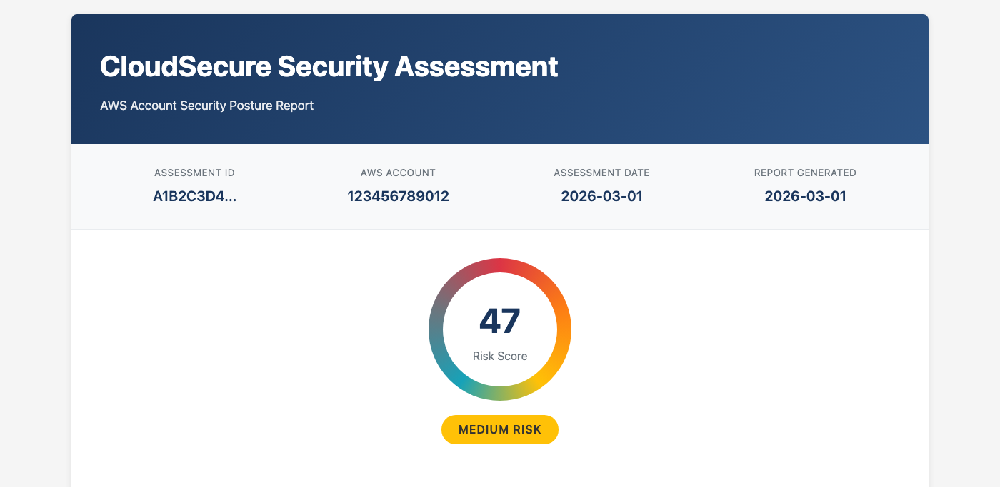
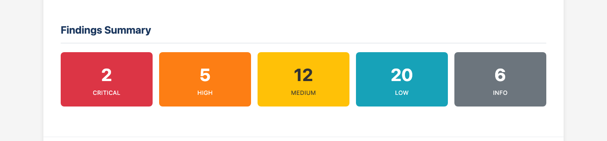
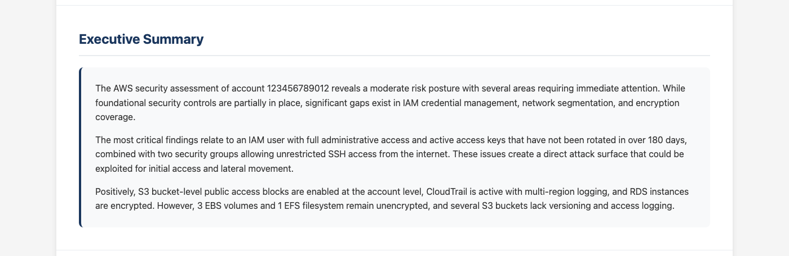
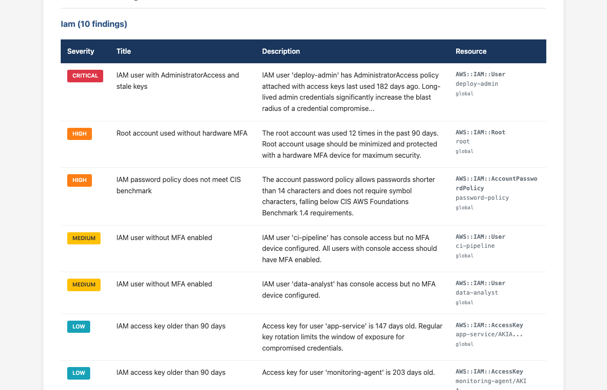

<p align="center">
  <h1 align="center">CloudSecure</h1>
  <p align="center">AI-powered AWS security assessment platform</p>
</p>

<p align="center">
  <a href="https://github.com/carlosinfantes/cloudsecure/blob/main/LICENSE"></a>
  
  
  
  
</p>

---

Agentless, serverless security assessment platform that scans any AWS account and delivers AI-synthesized findings — no credentials shared, no agents installed, no infrastructure to manage.

## The Problem

Traditional security tools (Prowler, ScoutSuite, Steampipe) run from an engineer's laptop:

- Long-lived credentials (access keys) required
- Credentials travel over the wire and get stored locally
- No audit trail of who ran what and when
- Scaling to multiple accounts = manual effort

## How CloudSecure Is Different

CloudSecure runs **100% serverless inside AWS**. No CLI, no laptops, no credentials to share.

- **Delegated access via IAM roles** — customers grant a read-only role via `STS AssumeRole` with `ExternalId`. No credentials exchanged, only trust delegated.
- **Fully serverless** — Lambda, Step Functions, DynamoDB, S3. Nothing to install, patch, or maintain.
- **AI-powered synthesis** — 7 analyzers run in parallel, Bedrock Claude synthesizes raw findings into prioritized, actionable intelligence.
- **Auditable by design** — every assessment tracked in DynamoDB with full execution trail through Step Functions.

## Report Demo

CloudSecure generates professional HTML reports with AI-powered executive summaries, risk scoring, and detailed findings across all security domains.

### Assessment Header & Risk Score


### Findings Summary


### AI-Powered Executive Summary


### Detailed Findings by Category


> Screenshots generated with fictitious data. See `docs/generate_demo_report.py` to regenerate.

## Architecture

```
┌──────────────────────────────────────────────────────────────┐
│                   CloudSecure Platform                        │
│                                                              │
│  ┌──────────┐  ┌───────────────┐  ┌────────────────────────┐ │
│  │   API    │──│ Step Functions │──│   7 Lambda Analyzers   │ │
│  │ Gateway  │  │  Orchestrator  │  │   (parallel execution) │ │
│  └──────────┘  └───────────────┘  └────────────────────────┘ │
│       │               │                      │               │
│  ┌──────────┐  ┌───────────────┐  ┌────────────────────────┐ │
│  │ DynamoDB │  │   Bedrock     │  │    S3 Reports          │ │
│  │          │  │   Claude AI   │  │  (HTML/JSON/CSV)       │ │
│  └──────────┘  └───────────────┘  └────────────────────────┘ │
└──────────────────────────────────────────────────────────────┘
                          │
                    STS AssumeRole
                     (read-only)
                          ▼
              ┌──────────────────────┐
              │   Customer Account   │
              │  (no agents needed)  │
              └──────────────────────┘
```

## Analyzers

| Analyzer | What It Checks |
|----------|---------------|
| **IAM** | Users, roles, policies, MFA, unused credentials, password policy |
| **Network** | Security groups, VPCs, Flow Logs, public exposure |
| **S3** | Public buckets, encryption, logging, versioning |
| **Encryption** | EBS, RDS, EFS encryption at rest |
| **CloudTrail** | Trail configuration, root usage, metric filters |
| **Native Services** | SecurityHub, GuardDuty, Config findings (if enabled) |
| **Prowler** | CIS AWS 1.4 benchmarks (17 critical checks) |

All analyzers run in parallel via Step Functions. Missing security services are reported as findings, not blockers.

## Compliance Mapping

Findings map to: **CIS AWS 1.4** · **NIST 800-53** · **ISO 27001** · **GDPR** · **SOC2**

## Quick Start

### Prerequisites

- AWS CLI configured with an IAM profile
- Node.js 18+ and Python 3.12+
- Docker (optional — required for Prowler CIS scanner)

### Install the CLI

```bash
pip install cloudsecure
# or
pipx install cloudsecure
```

Or use the installer script:

```bash
curl -fsSL https://raw.githubusercontent.com/carlosinfantes/cloudsecure/main/install.sh | bash
```

### Deploy the Infrastructure

Interactive guided deployment:

```bash
git clone https://github.com/carlosinfantes/cloudsecure.git && cd cloudsecure
./deploy.sh
```

Or manually:

```bash
cp .env.example .env    # Edit with your AWS profile, region, etc.
make install && make deploy

# Deploy without Docker/Prowler
SKIP_PROWLER=true make deploy
```

### Onboard a Customer Account

```bash
aws cloudformation deploy \
  --template-file onboarding/cloudformation/cloudsecure-role.yaml \
  --stack-name CloudSecure-AssessmentRole \
  --capabilities CAPABILITY_NAMED_IAM \
  --parameter-overrides ExternalId=your-external-id
```

### Upgrade Components

```bash
# Upgrade everything (infrastructure + Prowler + CLI)
./deploy.sh --upgrade

# Upgrade only specific components
./deploy.sh --upgrade infra     # Redeploy CDK stacks
./deploy.sh --upgrade prowler   # Pull latest Prowler image + redeploy
./deploy.sh --upgrade cli       # Upgrade CLI from PyPI
```

### Run an Assessment

```bash
# Start assessment — scans everything by default
cloudsecure --profile YOUR_PROFILE assess \
  --account-id 123456789012 \
  --role-arn arn:aws:iam::123456789012:role/CloudSecureAssessmentRole \
  --external-id your-external-id

# Scan only specific services
cloudsecure --profile YOUR_PROFILE assess \
  --account-id 123456789012 \
  --role-arn arn:aws:iam::123456789012:role/CloudSecureAssessmentRole \
  --external-id your-external-id \
  --scope iam --scope s3

# List all assessments
cloudsecure --profile YOUR_PROFILE status

# Check specific assessment
cloudsecure --profile YOUR_PROFILE status <ASSESSMENT_ID>

# Download report (HTML opens in browser)
cloudsecure --profile YOUR_PROFILE report <ASSESSMENT_ID> --format html --open

# Export as JSON or CSV
cloudsecure --profile YOUR_PROFILE report <ASSESSMENT_ID> --format json -o report.json
```

### Reports

```
s3://cloudsecure-reports-ACCOUNT_ID/assessments/ASSESSMENT_ID/
├── report.html    # Executive report with AI synthesis
├── report.json    # Full findings export
└── report.csv     # Spreadsheet format
```

## Tech Stack

| Component | Technology |
|-----------|-----------|
| Infrastructure | AWS CDK (TypeScript) |
| Analyzers | Python 3.12 (Lambda) |
| Orchestration | AWS Step Functions |
| API | API Gateway REST (IAM auth) |
| Database | DynamoDB |
| Storage | S3 + KMS encryption |
| AI Synthesis | AWS Bedrock (Claude) |
| Security Scanner | Prowler 5.x (Lambda container, optional) |
| Reports | HTML, JSON, CSV (Jinja2 templates) |
| CLI | Python (click, rich, boto3) — `pip install cloudsecure` |

## Documentation

- [Technical Specification](./docs/cloudsecure-assessment-platform-spec.md)
- [Implementation Progress](./IMPLEMENTATION.md)
- [Architecture Diagrams](./docs/diagrams/)
- [CLI Documentation](./cli/README.md)

## License

Apache-2.0 — See [LICENSE](./LICENSE)
